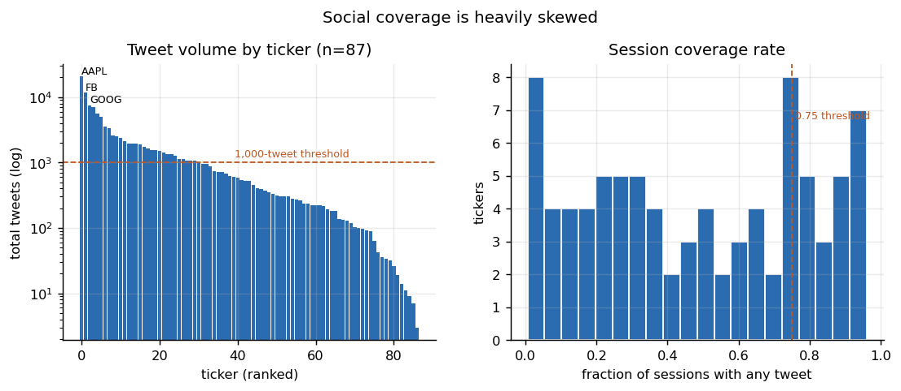
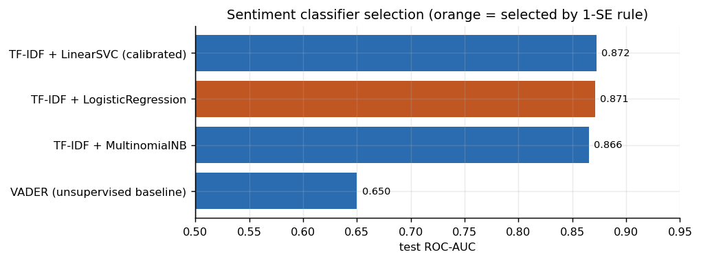
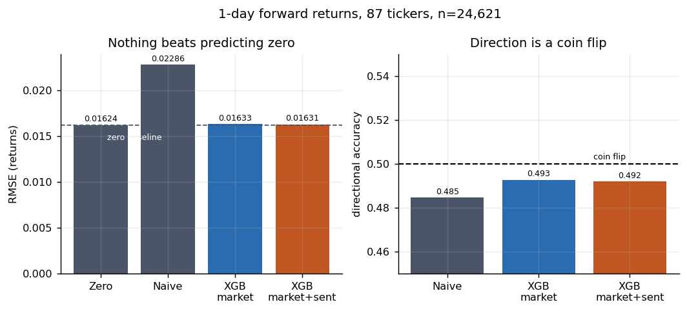
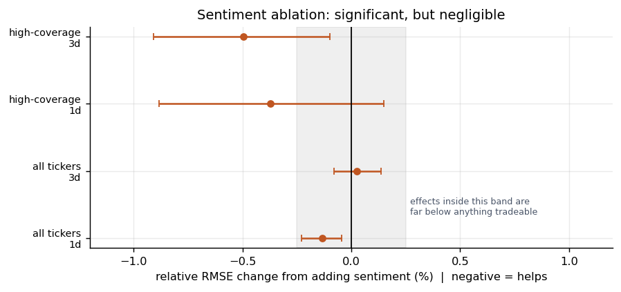
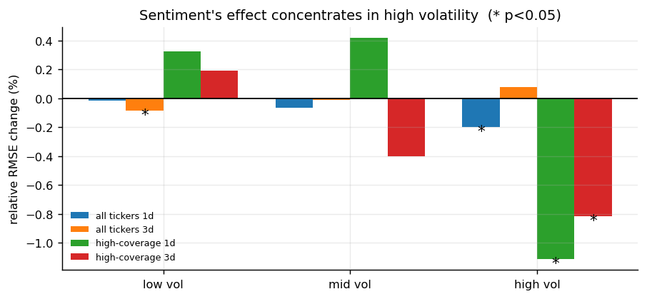
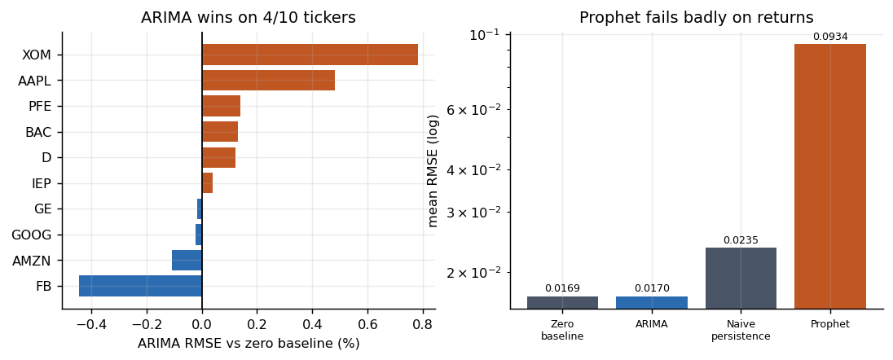

# Stock Return Forecasting from Social Sentiment

**Research question:** does social-media sentiment provide incremental predictive
signal for short-horizon stock returns beyond historical market information?

**Answer, measured:** essentially no. A statistically detectable but economically
negligible effect appears at large sample sizes, is inconsistent in sign across
metrics and horizons, and concentrates almost entirely in high-volatility
periods for heavily-discussed tickers. Neither model beats a zero baseline.

Every number below is read from files in `results/`, generated by the scripts in
`src/`. None are typed by hand.

---

## How this project got here

This started as a course project: two disconnected notebooks that classified
tweet sentiment and, separately, regressed pre-computed sentiment columns
against stock movement. Auditing it before rebuilding surfaced three problems.

**1. A fatal target leak.** The Spark regression predicted `Percent_Change`
while including `Percent_Change_Bin` — a direct binning of that same column —
in the feature vector. The reported R² of 0.3555 measured nothing but the
target predicting itself. The original notebook's own correlation output shows
the two at 0.595.

**2. A random split on temporal data.** `randomSplit([0.8, 0.2])` lets the model
train on the future and test on the past.

**3. An architectural disconnect.** The sentiment classifier's predictions were
never used. The forecasting notebook consumed a `Sentiment_Weighted` column of
unverifiable provenance, pre-aggregated by calendar date with no timestamp
information — so the alignment between "tweets" and "the close they preceded"
could not be checked at all.

Worth noting: the original notebook had already measured the honest answer. Its
correlations between sentiment features and next-day returns were −0.016,
−0.039, −0.001 and −0.006. That null result was simply buried underneath the
leaked regression.

The rebuild keeps what was sound (the hand-written finance text normaliser, the
labeled tweet corpus, the chronological-split instinct in the backtest cell) and
replaces the rest.

Legacy artifacts are preserved under `data/legacy/` rather than deleted.

---

## Data

| | Original project | This project |
|---|---|---|
| Price coverage | 57 sessions/ticker | **566 sessions/ticker** |
| Date range | 2016-03-11 → 2016-06-16 | **2014-01-02 → 2016-04-01** |
| Tweets | pre-aggregated, no timestamps | **~120K raw, timestamped** |
| Tickers | 82 | 87 |

**Primary dataset — StockNet.** 88 tickers across 9 sectors, with raw
timestamped tweets and daily OHLCV prices.

- Source: <https://github.com/yumoxu/stocknet-dataset>
- Citation: Xu & Cohen, *Stock Movement Prediction from Tweets and Historical
  Prices*, ACL 2018
- Download size: ~580 MB (not committed; see `scripts/download_data.sh`)

The 57-session window in the original data could not support ARIMA or Prophet
at all — a 5-fold walk-forward split leaves roughly 20 test observations per
ticker, and Prophet needs multiple seasonal cycles it does not have.



**Retained — labeled tweet corpus.** 5,791 hand-labeled finance tweets from the
original project (`data/raw/labeled_tweets.csv`). This is the only supervised
sentiment data available and it now trains the classifier that scores StockNet.

**Excluded fields.** Nothing derived from future observations enters the feature
matrix. `ret_fwd_*` columns are targets, structurally excluded by
`feature_columns()` and guarded by tests.

---

## Pipeline

```
5,791 labeled tweets ──→ finance text normalisation ──→ classifier selection
                                                                │
                                                     best validated model
                                                                │
StockNet raw tweets (~120K) ──→ dedup ──→ score ────────────────┘
                                            │
                          16:00 ET information cutoff  ← causal alignment
                                            │
                              daily sentiment aggregates ──┐
                                                           ├─→ SQL join (SQLite)
StockNet prices (87 × 566) ─→ Spark windowed features ─────┘        │
                                                                     ↓
                                                        panel: 48,838 rows
                                                                     ↓
                                             walk-forward split by calendar date
                                                                     ↓
              ┌────────────┬───────────┬──────────────┬──────────────┴────────┐
            Zero        Naive       ARIMA         Prophet          XGBoost
          baseline   persistence (per-ticker)   (per-ticker)   (pooled panel)
                                                                      │
                                                       market-only vs market+sentiment
```

---

## Temporal alignment

This is the part most worth reading closely.

Tweets carry UTC timestamps. US equity markets close at 16:00 America/New_York,
which is UTC−5 or UTC−4 depending on the date, so every tweet is converted to
market-local time rather than offset by a constant.

For a trading session `D`:

```
information_set(D) = { tweets t : prev_session(D) 16:00 ET < t <= D 16:00 ET }
features(D)        built only from information_set(D) and prices up to D's close
target(D)          = close(next_session(D)) / close(D) - 1
```

Consequences, all handled explicitly:

- A tweet at 18:30 ET Monday is **not** in Monday's set. Nobody had seen it at
  Monday's close.
- Weekend tweets accumulate into Monday. This makes Monday's tweet counts
  structurally larger, which is why `tweet_count` is a modelled feature rather
  than a nuisance to be normalised away.
- Market holidays behave like weekends. No holiday list is hard-coded — the
  valid session set is derived from the price file itself, which by construction
  contains only days the exchange traded.

**Measured impact: 42.8% of assigned tweets roll to a later session** than naive
calendar-date grouping would place them. That single number is the difference
between a causal pipeline and a leaky one.

---

## Sentiment model

Selection rule, fixed before any test score was inspected: take the highest
5-fold CV ROC-AUC on the training split, keep every model within one standard
error of it, and among those choose the **least complex**.

| Model | CV ROC-AUC | Test ROC-AUC | Test acc | Test F1 |
|---|---|---|---|---|
| VADER (unsupervised baseline) | — | 0.650 | 0.673 | 0.766 |
| TF-IDF + MultinomialNB | 0.832 | 0.866 | 0.738 | 0.825 |
| **TF-IDF + LogisticRegression** ← selected | 0.850 | **0.871** | 0.778 | 0.844 |
| TF-IDF + LinearSVC (calibrated) | 0.854 | 0.872 | 0.802 | 0.850 |



LinearSVC scored marginally highest but LogisticRegression falls within 1 SE
(0.0039) and is simpler, so the rule selects it. The supervised model beats the
VADER baseline by 22 AUC points, which is what justifies training one at all.

Deliberately not used: transformer-based finance sentiment models. The question
here is whether *a defensible sentiment signal* adds forecasting value, not
whether a marginally better sentiment model exists.

---

## Results



### Main comparison — 1-day forward returns, all 87 tickers

| Model | RMSE | MAE | Directional acc. |
|---|---|---|---|
| **Zero baseline** | **0.016240** | **0.011370** | — |
| Naive persistence | 0.022862 | 0.016374 | 0.4847 |
| XGBoost (market-only) | 0.016328 | 0.011456 | 0.4927 |
| XGBoost (market + sentiment) | 0.016307 | 0.011447 | 0.4919 |

n = 24,621 test observations across 5 expanding-window folds.

Three things to take from this table:

**Predicting zero wins.** Daily returns are close to unpredictable, so the
unconditional mean minimises squared error. Both XGBoost arms come in slightly
*worse*. This is the correct result for this problem, not a bug.

**Naive persistence is far worse, not better.** Because returns are nearly
uncorrelated, reusing today's return as tomorrow's forecast roughly doubles the
error variance. Benchmarking against persistence would flatter every model here;
the zero baseline is the honest reference.

**Directional accuracy is a coin flip** — 49–51.5% across every configuration.

### Sentiment ablation

Identical folds, identical purging, identical hyperparameter grid and selection
procedure. The only difference between arms is the feature columns. Negative
delta = sentiment helps.

| Universe | Horizon | Metric | Δ | 95% CI | p | Sig. |
|---|---|---|---|---|---|---|
| all (87) | 1d | RMSE | −0.0000220 | [−3.7e−5, −7.2e−6] | 0.004 | yes |
| all (87) | 1d | dir. acc | −0.00078 | [−0.0048, 0.0029] | 0.676 | no |
| all (87) | 3d | RMSE | +0.0000070 | [−2.3e−5, 3.9e−5] | 0.623 | no |
| high-cov (11) | 1d | dir. acc | **−0.0165** | [−0.032, −0.0016] | 0.027 | **yes, hurts** |
| high-cov (11) | 3d | RMSE | −0.000159 | [−2.9e−4, −3.2e−5] | 0.010 | yes |

The significant 1-day RMSE improvement is **0.13% relative**. With 24,621 paired
observations, a paired bootstrap resolves effects far below anything tradeable.
Meanwhile sentiment *reduces* directional accuracy by 1.6 points on the
high-coverage universe.

**Statistically detectable, economically negligible, directionally inconsistent.**



### Where sentiment does something

Robustness across 20 subgroups found 6 significant RMSE differences — all in the
same direction, against ~1 expected by chance — clustered in high volatility:

| Subgroup | Relative RMSE change | p |
|---|---|---|
| High-coverage, 1d, high volatility | **−1.11%** | 0.003 |
| High-coverage, 3d, high volatility | −0.81% | 0.016 |
| All tickers, 1d, high volatility | −0.20% | 0.009 |



Caveat stated plainly: these subgroups share underlying observations and are not
independent tests. The directional consistency is suggestive, not conclusive.

### Per-ticker classical models

Sector-stratified sample of 10 tickers, ranked by *training-window tweet volume*
— a property of the social data, never of returns or model error — so the sample
cannot have been selected for good performance.

| Model | RMSE | MAE | Directional acc. |
|---|---|---|---|
| **Zero baseline** | **0.016946** | **0.011885** | — |
| ARIMA | 0.016961 | 0.011896 | 0.5060 |
| Naive persistence | 0.023531 | 0.017107 | 0.4770 |
| Prophet | 0.093389 | 0.070786 | 0.5014 |



ARIMA beats the zero baseline on **4 of 10 tickers** — a coin flip. Prophet is
catastrophic in return space: it fits trend and seasonality to what is
essentially a random walk, then extrapolates them.

**Price-level task** (the only place MAPE is meaningful, since the denominator
is a positive price):

| Model | RMSE | MAE | MAPE |
|---|---|---|---|
| Random walk | 3.075 | 2.072 | **1.19%** |
| Prophet | 18.554 | 14.610 | 7.07% |

**Stationarity.** ADF on the training window: returns stationary for 10/10
tickers (median p = 5.9e−29); log prices stationary for 1/10 (median p = 0.181).
That is what justifies `d=0` on returns rather than an arbitrary choice.

### A note on comparability

ARIMA and Prophet are univariate per-series models. XGBoost here is a pooled
panel model sharing one parameter set across 87 tickers. They are different
estimators fitted on different amounts of data. They are reported side by side
with that stated, **not** merged into a single leaderboard implying a controlled
contest.

---

## Guarding against leakage

Given the original project's failure mode, leakage prevention is an explicit
engineering concern. 22 tests, all passing:

```bash
python3 -m pytest tests/ -q     # 22 passed
```

The most useful test perturbs every price *after* time `t`, rebuilds features,
and asserts the feature row at `t` is unchanged. That catches centred rolling
windows, negative shifts and lookahead joins in one assertion.

Others cover: target shifting correctness, trailing-only rolling windows, lag
features using past rows only, the 16:00 ET cutoff (including a DST case where a
fixed UTC−5 assumption would be wrong), weekend and holiday rolling, fold
disjointness, purging of boundary rows whose labels resolve inside the test
window, and a structural guard that no `ret_fwd_*` column can enter the feature
matrix.

**Purging** deserves a mention: the last training row before each test block has
a target realised *inside* that block. Without dropping it, every fold leaks its
first test outcome.

---

## SQL and Spark — honest scope

**SQL** owns the relational layer: loading market and sentiment tables, the
`(ticker, session)` LEFT JOIN (left, so zero-tweet sessions survive rather than
biasing the panel toward heavily-discussed stocks), coverage filtering, and the
per-ticker coverage report. See `sql/transformations.sql`.

Feature *arithmetic* stays in pandas, where trailing windows are clearer to
verify. The cutoff logic lives in exactly one module so the two paths cannot
drift apart.

**Spark** does partitioned windowed market transformations, writing Parquet
partitioned by ticker.

This dataset is ~49K market rows and ~119K tweets. That fits in memory, and
**Spark is not faster here** — JVM startup alone exceeds the entire pandas path.
It is used because the windowed per-ticker logic is what stops fitting in memory
as a universe grows from 87 tickers to thousands. The defensible claim is
"implemented Spark-based distributed preprocessing", not "processed data at
scale".

---

## Reproducing

```bash
git clone https://github.com/tanyasinghp/Stock-Trend-Prediction-Using-Tweets
cd Stock-Trend-Prediction-Using-Tweets
pip install -r requirements.txt

bash scripts/download_data.sh              # ~580 MB, StockNet

python3 src/sentiment/train_sentiment.py   # classifier selection
python3 src/ingestion/build_tweets.py      # score + session-align tweets
python3 src/features/build_panel.py        # SQL join -> panel
python3 spark/daily_processing.py          # Spark preprocessing (optional)

python3 src/forecasting/run_ablation.py    # core experiment
python3 src/forecasting/run_per_ticker.py  # ARIMA / Prophet
python3 src/forecasting/run_robustness.py  # subgroup analysis
python3 src/evaluation/make_figures.py     # all figures

python3 -m pytest tests/ -q                # 22 tests

jupyter notebook notebooks/results_analysis.ipynb   # walkthrough of results
```

---

## Limitations

- **One market regime.** 2014-01 to 2016-04 is a single, mostly-rising period.
  Conclusions may not transfer to other regimes.
- **Thin social coverage.** The median ticker sees about one tweet per session;
  only 48.1% of ticker-sessions have any tweets at all. The high-coverage subset
  exists precisely because the full universe is a weak test of the hypothesis.
- **Sentiment model is domain-transferred.** The classifier trains on a labeled
  corpus that is not StockNet, so label-distribution shift is unmeasured.
- **No transaction costs or execution modelling.** Nothing here is a strategy
  backtest, and no economic-significance claim is made.
- **Daily granularity only.** Intraday sentiment dynamics are invisible at this
  resolution.
- **Overlapping subgroups.** The robustness tests are not independent, so the
  6-of-20 significance count should not be read as a formal multiple-testing
  result.

## Repository layout

```
├── src/
│   ├── sentiment/     finance_text.py (retained), train_sentiment.py
│   ├── ingestion/     build_tweets.py
│   ├── features/      temporal.py, market.py, build_panel.py
│   ├── forecasting/   run_ablation.py, run_per_ticker.py, run_robustness.py
│   └── evaluation/    walk_forward.py, make_figures.py
├── configs/           experiment.yaml (all settings + pre-registered rules)
├── notebooks/         results_analysis.ipynb
├── sql/               transformations.sql
├── spark/             daily_processing.py
├── tests/             test_temporal.py, test_leakage.py
├── results/           all generated metrics + figures (README reads from here)
├── scripts/           download_data.sh
└── data/legacy/       original notebooks and CSVs, preserved
```
